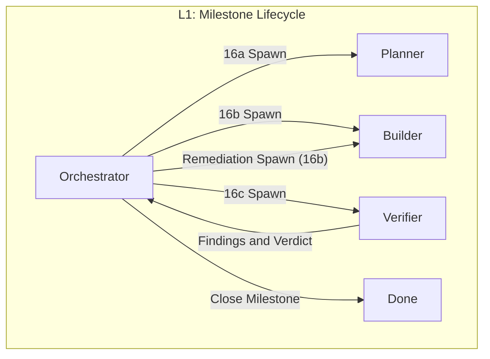
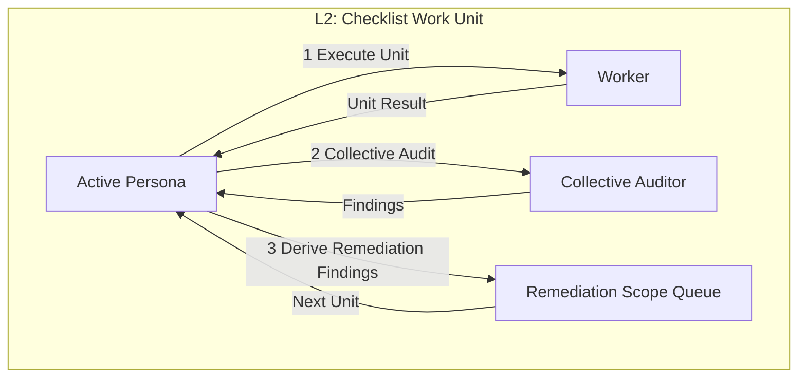
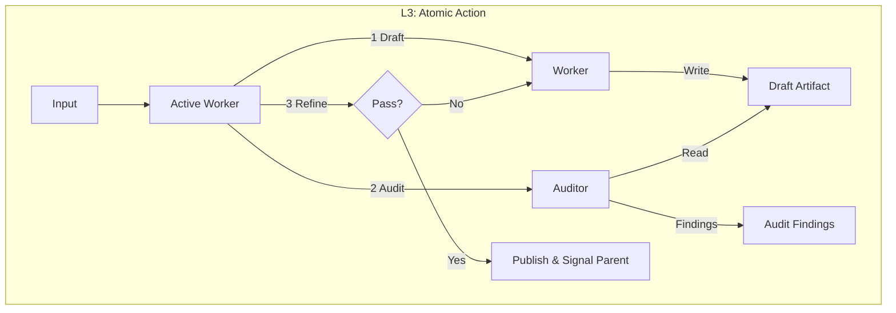

# Trinity Automation System Specification

## 1. System Overview
Trinity is a recursive, checklist-driven AI agent harness that automates the Step 16 implementation loop (`16a` planner, `16b` coder, `16c` reviewer) for a single DevSpec roadmap milestone at a time.

Trinity uses filesystem artifacts as the authoritative shared state, strict parent-child process boundaries, and deterministic tool-call contracts. It is designed for unattended AI-driven runs (including local OpenAI-compatible LLM endpoints), while preserving reproducibility, validation, and auditability.

Current maturity status:
- Trinity runtime orchestration (`specdev trinity`) supports LLM-driven state execution (`16a/16b/16c`) via OpenAI-compatible chat endpoints.
- Deterministic state handlers remain available as a compatibility strategy for offline testing, CI fixtures, and controlled replay scenarios.
- Prompt files are operational inputs in LLM strategy and governance contracts in both strategies.
- This document defines the normative target behavior and the compatibility surface.

### 1.1 Problem Statement
In long-running agentic implementation loops, the main failure modes are:
1. Context loss from window limits.
2. Spec drift from seeded constraints.
3. Hallucinated APIs/files/contracts.
4. Infinite repair loops without stop conditions.
5. Unverified code changes without evidence-bound tests.

### 1.2 System Goals
1. Spec authority: if it is not in governed spec artifacts, it does not exist.
2. Lossless persistence: any phase can hibernate/resume from disk.
3. Strict hierarchy: parent agents consume child artifacts, not child chats.
4. Self-correction: syntax, semantic, and policy checks run before human escalation.
5. Verified atomic units: checklist items close only with evidence-backed verification.

### 1.3 Core Operating Philosophy
1. Single active agent process at a time.
2. Parent-only spawning and mediation.
3. Filesystem artifacts are the execution truth.
4. Fractal loops at three levels:
   - L1: milestone orchestration.
   - L2: persona work-unit loop.
   - L3: atomic Draft -> Audit -> Refine -> Publish loop.

### 1.4 Confirmed Operating Decisions
- Execution engine: `specdev` CLI harness (non-interactive). Chat UI is optional.
- Base branch: `main`.
- Milestone branch naming: `trinity/{step_id}`.
- Invocation scope: exactly one milestone per `specdev trinity` invocation.
- Milestone selection: explicit `step_id`; fallback only if omitted.
- Canonical artifact IO contract: disk-first two-phase contract (questions + filesystem artifact).
- Tool interaction protocol: structured tool calls only; no freeform “paste code in chat” workflow.
- Governance: run governance checks on every incremental commit.
- Logging policy: single eval-grade structured logging strategy (no minimal strategy); logs must capture deterministic replay metadata, validation gates, and Step 16 evidence bindings.

---

## 2. Architecture

### 2.1 Three-Level Fractal Model

#### Level 1: Macro Loop (Orchestrator)


#### Level 2: Persona Loop (Example: Trinity Builder 16B)


#### Level 3: Atomic Loop (Worker)


### 2.2 Persona and Prompt Map
Core Step personas map to existing versioned Step 16 prompts. Utility personas are guided by a dedicated Trinity utility prompt library.

| Persona | Responsibility | Prompt Source |
| :--- | :--- | :--- |
| Orchestrator | Anchor lifecycle and state transitions | `devspec_toolkit/prompts/prompt_16_impl_context.md` + harness transition rules |
| Trinity Planner 16A | Produce/update milestone plan sections | `devspec_toolkit/prompts/prompt_16a_impl_planner.md` |
| Trinity Builder 16B | Execute checklist item implementations | `devspec_toolkit/prompts/prompt_16b_impl_coder.md` |
| Trinity Verifier 16C | Review implementation and evidence; emit findings/verdict | `devspec_toolkit/prompts/prompt_16c_impl_reviewer.md` |
| Auditor | Generic critique pass for L3 loops | `devspec_toolkit/prompts/trinity/99_auditor.md` |
| Summarizer | Extraction-only evidence snippet support for long outputs | `devspec_toolkit/prompts/trinity/90_summarizer.md` |
| ToolUser | Deterministic tool-call behavior | `devspec_toolkit/prompts/trinity/80_tool_usage.md` |
| Researcher | Optional bounded context discovery | `devspec_toolkit/prompts/trinity/70_researcher.md` |

### 2.3 Utility Prompt Library (Normative Contract)
Utility prompt library location:
- `devspec_toolkit/prompts/trinity/`

Required prompt files:
1. `70_researcher.md`
2. `80_tool_usage.md`
3. `90_summarizer.md`
4. `99_auditor.md`

Guardrails:
- Each file must include a version header (e.g., `Version: 1.2`) and a change log section listing dated changes.
- Each file should define explicit input contract, output schema, stop conditions, and prohibited behavior.
- Utility prompts are part of the normative Trinity contract for utility-persona execution.
- If a state invokes a utility persona and the corresponding prompt file is unavailable, that branch must fail fast as blocked.
- Utility prompts must enforce assumption-free behavior: unresolved context must be surfaced as explicit questions or blocked findings, never guessed.

Utility Fast-Path:
- For utility invocations where the input is a single artifact and the expected output is a single structured response, the runtime may use an inline utility protocol that skips file-based `task_input.json`/`task_result.json` IO. The inline result must still be schema-validated and logged as a session event. The full spawn protocol remains required for multi-artifact or multi-turn utility sessions.

---

## 3. Artifact Model and Lifecycle

### 3.1 Authoritative Artifacts
Trinity uses two Step 16 artifacts with different responsibilities:
1. Milestone state machine (authoritative execution file): `spec/impl_context/{step_id}.json`.
2. Anchor roll-up (derived union/summary): `spec/16_impl_context.json`.

### 3.2 Milestone vs Anchor Rules
- The per-milestone file is the source of truth for Plan/Execute/Review lifecycle.
- The anchor is derived from active milestone context files and is never the canonical source for per-milestone execution details.
- Trinity Planner 16A updates the milestone file for the active `step_id`; it does not treat the anchor as the primary editable state.

### 3.3 Anchor Regeneration Policy
- Regenerate `spec/16_impl_context.json` at milestone start.
- Regenerate again after each successful L1 state transition (`16a`, `16b`, `16c`).
- Context pack must be regenerated alongside the anchor at every state transition.
- On resume, if the anchor timestamp is older than the most recent milestone context timestamp, regenerate the anchor before re-entering the active state.
- Preserve `extensions` and explicitly manual notes across regeneration.
- Only update fields required by the anchor prompt and schema contract.
- Anchor regeneration must not independently mutate roadmap/progress completion status; milestone closure state is owned by Verifier verdict + Orchestrator transition logic.

---

## 4. Context Governance (Seed-Manifest Authority)

### 4.1 Spec Authority Set
Trinity must resolve context from governed seeds, not from hard-coded assumptions.

Required authority set:
1. `spec/common/seed_manifest.json`.
2. `step_requirements["16a"|"16b"|"16c"]` from the seed manifest.
3. Core Step artifacts (as required by seed/state), commonly including:
   - `spec/04_fr_list.json`
   - `spec/05_interface_contracts.json`
   - `spec/06_invariants.json`
   - `spec/07_nfrs.json`
   - `spec/08_fixtures.json`
   - `spec/09_impl_plan.json`
   - `spec/10_governance.json`
   - `spec/11_redteam.json`
   - `spec/12_ci_gates.json`
   - `spec/13_extension_manifest.json`
   - `spec/13a_completeness_assessment.json`
   - `spec/14_roadmap.json`
   - `spec/15_scaffold.json` (when relevant)

No Trinity rule may bypass seed-manifest governance.

### 4.2 Deterministic Context Resolver
`ContextResolver(step_id, state)` must return:
1. Ordered seed files to load (exact seed-manifest order).
2. Allowed read paths.
3. Allowed write paths from `target_file_patterns` and docs policy.
4. Required spec artifacts for `spec_ref` traceability.

### 4.3 Spec Reference Resolver
`SpecRefResolver(spec_type, id)` must resolve deterministic provenance:
- `path`
- `line_range` (`Lx-Ly`)
- `commit_hash` (40-char SHA)

The harness must never emit `spec_ref` records without these fields.
Grounding checks are mandatory:
- `spec_ref.id` must exist in authority artifacts resolved by `ContextResolver`.
- `spec_ref.commit_hash` must exist in git history.
- `spec_ref.line_range` must map to the referenced file content at that commit.
- Staleness check: if the content at `line_range` differs between `commit_hash` and HEAD, emit a `drift` warning in the session log and in `plan.drift` if applicable.

### 4.5 Context Pack Budget
Context pack total token estimate must not exceed `limits.hard_token_limit`. Budget enforcement rules:
- If estimated tokens for `context_pack.json` contents exceed `limits.soft_token_limit`, lower-priority context items (by reverse `global_seed_order`) are truncated with a `context_budget_truncation` event in the session log.
- The token estimate uses a configurable approximation ratio (`runtime.token_estimation_ratio`, default: 4 chars per token).
- Truncated items retain their pointer/reference but have `content: null` with `truncation_reason: "budget"` in the context pack.

### 4.4 Need-to-Know Context Handover
Parent-child communication is strictly artifact-based.

Parent -> Child input contract (`.trinity/runtime/spawns/<child_id>/task_input.json`):
- `protocol_version`
- `child_id`
- `parent_id`
- `role` (mapped to Persona)
- `phase` (mapped to State ID)
- `step_id`
- `task_description`
- `expected_output_schema`
- `context_pack_ref`
- `target_files` (paths only; child loads file content as needed)
- `spec_refs` (IDs/pointers; child resolves through governed artifacts)
- `role_metadata` (prompt role metadata for the active state)

Child -> Parent output contract (`.trinity/runtime/spawns/<child_id>/task_result.json`):
- `protocol_version`
- `child_id`
- `role`
- `phase`
- `step_id`
- `status`
- `summary`
- `artifacts`
- optional structured findings/questions

Rules:
- Parent never consumes child raw conversation transcript.
- Child starts with no inherited chat history and relies on explicit artifacts + governed context.
- Handover should pass pointers first, not bulk content, unless explicitly required by phase validation.

### 4.5 Seed Mutation Ownership
- Seed/manifest mutation is owned by Orchestrator + Trinity Planner 16A states only.
- Trinity Builder 16B and Verifier 16C must not mutate `spec/common/seed_manifest.json` or seed-required authority sets.
- If Builder/Verifier are blocked by missing seed context, they emit explicit ambiguity/findings and return control to Orchestrator.
- Orchestrator may trigger a controlled re-plan cycle (`16a`) after a new spec baseline commit.

---

## 5. Artifact Exchange Contract (Disk-First Two-Phase IO)
Trinity follows a disk-first two-phase contract:

1. Phase A: questions only.
   - Persona emits only clarifying questions when blocked.
   - Harness pauses for user input; no guessing.

2. Phase B: artifact only.
   - Persona writes/updates the artifact file at the expected `spec/...` path.
   - Persona returns a concise status message with artifact path and validation outcome.
   - Harness immediately runs schema + deep validation gates.

This is the only documented artifact exchange mechanism.

### 5.1 Prompt Contract Conformance Rules
- All Step 16 prompts used by Trinity (`prompt_16_impl_context.md`, `prompt_16a_impl_planner.md`, `prompt_16b_impl_coder.md`, `prompt_16c_impl_reviewer.md`) must conform to Section 5 disk-first IO behavior.
- Prompt examples must be schema-valid JSON artifacts (no inline JSON comments, no schema-invalid placeholder fields).
- Example artifacts should be sourced from validated fixture artifacts to prevent prompt/schema drift.

---

## 6. Trinity Loop Protocol (Checklist-First State Machine)

Machine-checkable lifecycle reference:
- `docs/designs/trinity_state_machine.json` is the normative state/transition artifact for L1 orchestration behavior.

### 6.1 Level 1: Macro Loop (Orchestrator)
Definition: milestone lifecycle over `spec/impl_context/{step_id}.json`.

1. Spawn Planner (`16a`) and validate plan.
2. Spawn Builder (`16b`) and execute checklist implementations.
3. Spawn Verifier (`16c`) and audit evidence + outcomes.
4. If verifier returns blocking findings, Orchestrator routes to Planner for re-plan before any further Builder run.
5. If verified, sync roadmap/progress artifacts and close the milestone run.

### 6.2 Level 2: Persona Loop
Definition: persona-specific work unit loop.

Common structure:
`Execute -> Collective Audit -> Derive Remediation Units -> Repeat`

#### 6.2.1 Trinity Planner 16A
- Work unit: planning sections inside `spec/impl_context/{step_id}.json`.
- Produces checklist-first plan in schema-grounded fields.
- Validates traceability against seeded artifacts.

#### 6.2.2 Trinity Builder 16B
- Work unit: checklist items from `plan.spec_alignment.checklist[]`.
- Iterates checklist units and runs L3 loops per unit.
- Updates execution/implementation state for existing checklist IDs only.
- Must not create/reorder checklist items; remediation item creation is owned by Planner/Verifier handoff.
- Proposed additions: when Builder encounters a requirement gap that is clearly in-scope but absent from the plan, it may emit a `proposed_additions[]` array in `execution.emergent_ambiguities` with severity `informational`. These are not published to the checklist — they are routed to Planner via the Remediation path.

#### 6.2.3 Trinity Verifier 16C
- Work unit: review sections in milestone context.
- Runs verification actions and evaluates evidence bindings, docs gates, and CI gates.
- Emits `review.findings[]` and final `review.verdict`.

### 6.3 Level 3: Atomic Loop (Worker Lifecycle)
Definition: one atomic checklist implementation or verification action.

Normative loop rule:
- L3 is a true loop, not a single pass. Each atomic unit repeats `Draft/Execute -> Audit/Review -> Refine` until pass criteria are met or retry caps are exceeded.

States:
1. Optional Research
   - Goal: gather missing bounded context.
   - Output: structured research fragment under `extensions`.
2. Draft/Execute
   - Goal: satisfy `checklist_item.implementation`.
   - Output fragment: `implementation.{status,files_touched,actions}`.
3. Verify
   - Goal: run required commands and collect evidence-bound results.
   - Output fragment: `execution.execution_results[]`.
4. Audit
   - Goal: audit correctness, completeness, drift, tests, docs, and scope.
   - Output fragment: `review.{findings,verdict,...}`.
5. Publish
   - Parent merges validated fragment into milestone artifact and checkpoints state.

Audit scope boundary:
- L3 Audit scope is one checklist item. L2 Collective Audit scope is the full state output. When both invoke `99_auditor.md`, they differ in `audit_scope.checklist_ids` — L3 uses a single ID; L2 uses all IDs touched in the current state.

### 6.4 Checklist-First Semantics
- Trinity must not invent or depend on a `plan.tasks` field.
- Work queue is a derived view of checklist state.
- Ordering is inferred from:
  - `plan.solution.sequence_of_concerns`
  - file overlap/conflict heuristics
- No new untyped task array is written into Step 16 artifacts.

### 6.5 Retry Caps and Stop Conditions
Retry caps are configured in `.trinity/trinity.yaml` under `runtime.retry_caps`.

Default caps:
- `16a` planner retries: 10.
- `16b` builder retries: 10.
- `16c` verifier retries: 10.
- Global milestone loop cap (`runtime.retry_caps.milestone`): 10.

Cap interaction semantics:
- The milestone retry cap counts L1 loop iterations (each being one full `16a→16b→16c` pass or remediation cycle).
- Per-state caps count retries *within* a single L1 iteration.
- Thus a milestone cap of 10 allows up to 10 full cycles, each cycle allowing up to 10 retries per state.

On blocker conditions (missing seed, out-of-scope write, failed tests after max retries):
- Stop the active branch immediately and mark milestone deferred/blocked with explicit findings and ambiguities.
- Route remediation through Planner-first re-plan before resuming Builder/Verifier.

### 6.6 Verdict Contract
- `review.verdict` values are restricted to Step 16 enum values only: `verified | deferred | rejected`.
- Trinity orchestration must not branch on any non-schema verdict value.

### 6.7 Planner Scope Budgets
Configurable scope rails prevent over-scoping:
- `runtime.scope_budget.max_checklist_items` (default: 30).
- `runtime.scope_budget.max_target_files` (default: 50).
- `runtime.scope_budget.max_seed_additions` (default: 5).

If Planner exceeds any budget, the state gate emits a `scope_budget_exceeded` finding and blocks until overridden via user input or replanned within budget.

---

## 7. Tool Protocol and Scope Enforcement
Trinity harness must expose strict typed tool calls with deterministic contracts.

### 7.1 Required Tool Capabilities
1. `read_file(path, start_line?, end_line?)`
2. `write_file(path, content)` (atomic)
3. `edit_file(...)` and/or deterministic `apply_patch(...)`
4. `list_dir(path)` and `glob_match(path, patterns[])`
5. `search_text(pattern, paths[])` with line numbers
6. Git utilities: `git_head`, `git_show`, `git_diff`
7. `exec_cmd(command, mode)` with structured result metadata
8. Validation gate: `specdev validate` / `validate_json`
9. Checkpoint utilities: deterministic git checkpoint operations for branch creation/switch and commit checkpoints required by Section 10.

Wire-contract requirement:
- Tool invocations and results must be representable as typed envelopes validated against Trinity tool protocol schemas (request/result), not ad-hoc freeform structures.
- `tool_name` must deterministically select a typed payload contract for request `args` and result `result`.
- Unknown tool names, unknown payload fields, or missing required tool payload fields are schema-level failures.

### 7.2 Write-Path Guardrails
- Allowlist writes from `plan.summary.target_file_patterns` + docs policy.
- Out-of-scope writes are blocked at the tool layer.
- Tooling enforces path checks before applying file changes.

### 7.3 Command Capture Contract
For every command invocation, record at minimum:
- command
- exit_code
- duration_ms
- timestamp
- working_dir
- pointer to updated Step 16 artifact

### 7.4 Execution Strategies
`exec_cmd` supports two strategies:
1. Standard strategy
   - For short outputs (discovery and quick checks).
   - Returns bounded output directly.
2. Summarized strategy
   - For long outputs (tests/builds/lints).
   - Uses extraction-oriented summarizer flow and returns concise extracted evidence context.

Selection rule:
- Use summarized strategy when output length is expected to exceed bounded output thresholds or when evidence extraction is required.

Deterministic pre-scan:
- For `summarized` strategy, a deterministic pre-scan state runs before LLM summarization. The pre-scan extracts lines matching configured marker patterns (`PASSED`, `FAILED`, `ERROR`, `exit code`).
- If the pre-scan finds definitive pass/fail markers, the LLM Summarizer is skipped and the deterministic result is used.
- LLM Summarizer runs only when markers are ambiguous or missing.

### 7.5 Tool Argument Safety
- Before executing write operations, the tool layer must verify the target path exists (for edits) or the parent directory exists (for new files). Non-existent path writes must be propagated as `tool_error` with a descriptive message, not silently handled.
- LLM output JSON extraction uses a three-tier parser: (1) direct `json.loads`, (2) fenced code block extraction, (3) brace-balanced extraction with depth limit of 50. If tier 3 is used, the extracted payload must pass schema validation before acceptance. If validation fails, the response is treated as malformed and retried.

### 7.6 Runtime Protocol Schemas
Runtime protocol artifacts are schema-governed:
- `task_input.json` -> `devspec_toolkit/schema/trinity/task_input.schema.json`
- `context_pack.json` -> `devspec_toolkit/schema/trinity/context_pack.schema.json`
- `task_result.json` -> `devspec_toolkit/schema/trinity/task_result.schema.json`
- `.trinity/runtime/tools/tool_call_request.json` -> `devspec_toolkit/schema/trinity/tool_call_request.schema.json`
- `.trinity/runtime/tools/tool_call_result.json` -> `devspec_toolkit/schema/trinity/tool_call_result.schema.json`
- `.trinity/sessions/*.jsonl` -> `devspec_toolkit/schema/trinity/session_event.schema.json`
- `.trinity/logging/log_capture_policy.json` -> `devspec_toolkit/schema/trinity/log_capture_policy.schema.json`
- `.trinity/runtime/scratchpads/scratchpad_*.json` -> `devspec_toolkit/schema/trinity/scratchpad_state.schema.json`
- `.trinity/runtime/session_state_*.json` -> `devspec_toolkit/schema/trinity/session_state.schema.json`
- `.trinity/runtime/spawn_log.json` -> `devspec_toolkit/schema/trinity/spawn_log.schema.json`

Validation rules:
- Harness validates each runtime protocol file before child spawn and before parent ingestion.
- Schema violations are blocking errors and must stop affected branches.
- Deep validation is also required for relational constraints that schemas cannot fully express (seed order consistency, allowlist/write-scope checks, task-input/context-pack consistency checks, required_spec_refs git grounding checks, and phase-gate completeness checks for successful `16a/16b/16c` outputs).
- Session log deep validation must enforce transaction-boundary closure for child handoffs in canonical order: canonical `SPAWN`, pass `VALIDATION` for task input, pass `VALIDATION` for task result, then canonical `TERMINATE` for the same child span.

### 7.6 Prompt-Side Tool Schema Budget Policy (Normative)
Goal:
- Prevent token-window inflation from repeatedly injecting full per-tool schemas while preserving strict deterministic contracts.

Required behavior:
1. Catalog-first prompt contract:
   - Default prompt context includes only compact tool catalog entries (`tool_name`, short description, required argument keys, critical constraints).
   - Full JSON schemas are not injected by default.
2. On-demand full schema expansion:
   - Full tool schema is injected only for tool(s) selected for planning/execution in the current action scope.
   - Expansion must be minimal and limited to those tool names.
3. Schema identity references:
   - Prompt context should prefer schema references (`schema_uri`, `schema_version`, `schema_sha256`) over repeated inline schema bodies when unchanged.
   - Runtime metadata should preserve these references for reproducibility and audit.
4. Hard runtime enforcement remains authoritative:
   - Prompt-side compaction is an optimization only.
   - Final correctness is always decided by runtime schema + deep validation gates.
5. Fail-safe escalation:
   - If compact catalog is insufficient to disambiguate an argument/result shape, the role must request on-demand full schema instead of guessing.
6. Machine-enforced observability:
   - `TOOL_CALL` and `TOOL_RESULT` session events must include `metadata.tool_schema_context` (`strategy`, `request_schema_uri`, `request_schema_sha256`, `result_schema_uri`, `result_schema_sha256`, and `expanded_tool_names`; plus `catalog_ref`/`catalog_sha256` when catalog strategies are used).
   - Runtime deep validation must enforce context consistency (for example, on-demand strategy must name expanded tools rather than leaving expansion implicit).

---

## 8. Evidence Binding, Logging, and Secret Safety

### 8.1 Step 16 Evidence Requirements
For passed execution results:
- `execution.execution_results[].evidence` contains a verbatim excerpt with pass markers.
- `execution.execution_results[].evidence_binding.sha256` is the SHA-256 hash of the exact `evidence` string.
- `execution.execution_results[].evidence_ref` format: `sha256:<hash>`.

Summaries are UI-only. Evidence fields in Step 16 artifacts are never paraphrased.

### 8.2 Long Output Strategy
For long command outputs in unattended runs:
- Use extraction-oriented summarizer behavior to select concise verbatim lines containing pass/fail markers and minimal surrounding context.
- If no compliant evidence excerpt can be produced, treat the checklist item as blocked.

### 8.3 Logging Strategy and Event Contract
Trinity uses one logging strategy:

1. Eval strategy (default and only strategy)
   - Persist structured event stream with deterministic replay fields.
   - MVP baseline: apply deterministic redaction profile metadata per event and enforce command allow/deny policy for common secret-dumping patterns.
   - Post-MVP hardening target: enforce pre-persist secret scanning/redaction for all persisted prompt/response artifacts so raw secrets are never written to disk.
   - Persist Step 16 evidence excerpts and hash bindings exactly as produced.
   - Persist validation gate outcomes and lineage keys (`tool_call_id`, `result_id`, `artifact_ref`, `artifact_sha256`, `diff_ref`).
   - Apply capture policy tuning for prompt/response full-capture sampling via policy file.
   - Operate in logging-first strategy by default: session/eval artifacts are persisted locally and in CI artifacts, with no external eval backend required.
   - External export/publish is optional and must not be required for core Trinity execution correctness.

Session log contract:
- Format: JSONL.
- Path: `.trinity/sessions/<timestamp>_<root_task_id>.jsonl`.
- Aggregation: one root session file containing child events linked by IDs.
- Event types: `SPAWN`, `MESSAGE`, `TOOL_CALL`, `TOOL_RESULT`, `VALIDATION`, `TERMINATE`, `ERROR`.
- Log schema: `devspec_toolkit/schema/trinity/session_event.schema.json`.
- Every event must validate against the log schema before persistence.

Event schema:
```json
{
  "schema_version": "trinity-session-log-v1",
  "timestamp": "ISO-8601",
  "event_type": "SPAWN | MESSAGE | TOOL_CALL | TOOL_RESULT | VALIDATION | TERMINATE | ERROR",
  "event_id": "uuid",
  "event_sequence": 1,
  "prev_event_sha256": "previous_event_hash_or_null",
  "event_sha256": "current_event_hash",
  "run_id": "root_run_id",
  "phase_id": "state_identifier",
  "loop_id": "loop_identifier",
  "agent_id": "unique_session_id",
  "parent_id": "calling_agent_id",
  "role": "Orchestrator | Planner | Builder | Verifier | Worker | Researcher | Auditor | Summarizer | ToolUser",
  "step_id": "current_step_id",
  "tool_call_id": "stable_tool_call_id_or_null",
  "result_id": "stable_result_id_or_null",
  "artifact_ref": "path_or_uri_or_null",
  "artifact_sha256": "sha256_or_null",
  "diff_ref": "git_diff_ref_or_null",
  "model": "gpt-5-or-local",
  "content": {
    "summary": "...",
    "capture_level": "none|summary|full",
    "capture_decision_reason": "policy:default|policy:always_full|policy:sampled|policy:capped",
    "prompt_artifact_ref": "path_or_null",
    "prompt_sha256": "sha256_or_null",
    "response_artifact_ref": "path_or_null",
    "response_sha256": "sha256_or_null",
    "task_input_artifact_ref": "path_or_null",
    "task_result_artifact_ref": "path_or_null",
    "tool_call": { "name": "...", "args": {} },
    "tool_result": {
      "command": "...",
      "exit_code": 0,
      "duration_ms": 1200,
      "working_dir": "...",
      "stdout_excerpt": "...",
      "stderr_excerpt": "...",
      "truncated": false
    },
    "validation": {
      "schema": "pass|fail|n/a",
      "deep_validator": "pass|fail|n/a",
      "governance": "pass|fail|n/a",
      "seed_lint": "pass|fail|n/a",
      "docs_lint": "pass|fail|n/a"
    }
  },
  "metadata": {
    "toolkit_version": "...",
    "schema_version": "...",
    "git_head": "...",
    "prompt_template_id": "prompt_16b_impl_coder",
    "prompt_template_sha256": "sha256_of_prompt_template",
    "redaction_profile": "eval",
    "redaction_applied": false,
    "capture_policy_ref": "path_or_null",
    "capture_policy_sha256": "sha256_or_null",
    "redaction_stats": {
      "total_replacements": 0,
      "by_class": { "api_key": 0, "token": 0 },
      "classes_detected": [],
      "detectors_used": ["secret_scanner_v1"],
      "min_confidence": 0.0,
      "max_confidence": 0.0
    },
    "decoding": { "temperature": 0.2, "top_p": 0.9, "max_tokens": 4096 },
    "token_usage": { "prompt": 0, "completion": 0, "total": 0 }
  }
}
```

Traceability rules:
- `SPAWN` records child intent and `child_id`.
- `TERMINATE` records status summary and final artifact pointers for the child scope.
- `parent_id` and `agent_id` reconstruct the full call tree deterministically.
- `TOOL_CALL` and `TOOL_RESULT` are joined by `tool_call_id`.
- Artifact lineage and replay use `artifact_ref` + `artifact_sha256` + `diff_ref`.
- Deterministic replay ordering and tamper detection use `event_sequence` + `prev_event_sha256` + `event_sha256`.
- Full-text capture for eval (when enabled) is referenced via `prompt_artifact_ref`/`response_artifact_ref` and corresponding SHA-256 hashes.
- Capture-level decisions are policy-governed and must be explainable via `capture_decision_reason`.

Training/export compatibility:
- Preserve native event schema as source-of-truth.
- Provide derived export view mapped to OpenAI-style `messages[]` during dataset generation.
- Export rows should validate against `devspec_toolkit/schema/trinity/eval_export_row.schema.json`.

### 8.4 Sensitive Data Handling for Logs
MVP scope:
- Continue unattended execution when sensitive output is detected, with best-effort redaction metadata and command allow/deny policy for common secret-dumping commands.
- If compliant non-sensitive verbatim evidence (with required pass markers) cannot be produced, mark the unit blocked and escalate for human input.
- Dataset export pipelines must support deterministic redaction profiles before external sharing.
- Step 16 evidence fields remain verbatim excerpts with pass markers and cannot be paraphrased.

Post-MVP scope:
- Add mandatory pre-persist secret scanning/redaction for persisted prompt/response/session artifacts.
- Add fail-closed behavior for full-capture events that cannot be safely redacted before write.
- Promote "no raw secret persistence on disk" from aspirational constraint to runtime-enforced invariant.

---

## 9. Session and Resume Model

### 9.1 Single Active Agent + Disk Call Stack
When parent spawns child:
1. Parent writes `session_state_<parent_id>.json` and pending spawn entry.
2. Parent terminates.
3. Child executes from `.trinity/runtime/spawns/<child_id>/task_input.json` and writes `.trinity/runtime/spawns/<child_id>/task_result.json`.
4. Parent resumes, ingests child summary/artifacts, and updates spawn status.

Contracts:
- `session_state_<parent_id>.json` must validate against `schema/trinity/session_state.schema.json`.

### 9.2 Loop Detection
Parent tracks repeated spawn intents in `spawn_log`.
- If identical purpose exceeds configured retries, parent aborts current branch with explicit blocked status.

Contracts:
- `spawn_log.json` must validate against `schema/trinity/spawn_log.schema.json`.

### 9.3 Concurrency and Integrity
- Artifact writes use atomic writes; file locks are required only when multi-process strategy is enabled.
- Parent merge uses deterministic field-level merge for child fragment ingestion and retry replay.
- Conflict detection guards against stale child artifacts (state drift), not only concurrent sessions.
- Merge strategy must be documented and testable.
- Merge precedence is deterministic: latest valid child artifact for the same state/checklist scope wins; out-of-phase fragments are rejected as stale.
- Crash consistency requirement: spawn IO write, validation result, and session-log event append must be atomic as a transaction boundary per state handoff.

### 9.4 Context Flush and Recovery
When token or state boundaries are reached:
1. Serialize compressed state to `.trinity/runtime/scratchpads/scratchpad_<task_id>.json`.
2. Store active variables and next action.
3. Reset messages.
4. Resume by reloading scratchpad + current milestone artifact.

Scratchpad requirements:
- Scratchpad content is structured and schema-validated (no freeform-only recovery state).
- Scratchpad must include phase, checklist scope, last successful validation gate, and pending next action pointer.
- Scratchpad schema: `devspec_toolkit/schema/trinity/scratchpad_state.schema.json`.
- Optional human-readable scratchpad views are derived artifacts and must not be used as execution source-of-truth.

Scratchpad lifecycle (S-2):
- A scratchpad file is created at the start of an L2/L3 loop and persisted on every state boundary.
- On successful state completion, the scratchpad is archived to `.trinity/runtime/scratchpads/archive/`.
- On crash recovery, the most recent scratchpad for the active task_id is loaded.
- Stale scratchpads (from completed or abandoned runs) are cleaned up at the start of a new milestone run.

Session log rotation (S-3):
- When a session log exceeds 5000 events (configurable via `runtime.session_log_compaction_threshold`), the runtime rotates the active log file and creates a compacted summary event at the start of the new file referencing the archived segment.
- Archived segments are preserved for replay/eval but are not loaded during active execution.

Workspace cleanup (S-4):
- Intermediate draft/audit versions (`artifacts/v<N>_*`, `reports/audit_v<N>_*`) are preserved until milestone completion.
- On milestone closure, only the final published version is promoted; intermediate versions are archived to `.trinity/workspace/<task_id>/archive/`.
- Clean-up is deferred by default; `runtime.workspace_cleanup: eager` archives immediately after each L3 loop completes.

### 9.5 Workspace Artifact Versioning
For iterative Draft -> Audit -> Refine loops, Trinity maintains versioned workspace artifacts:

```text
.trinity/
  workspace/
    <task_id>/
      artifacts/
      reports/
      logs/
```

Versioning rules:
- Drafts: `artifacts/v<N>_<filename>`
- Audit reports: `reports/audit_v<N>_<filename>.md`
- Child spawn IO: `.trinity/runtime/spawns/<child_id>/task_input.json` and `.trinity/runtime/spawns/<child_id>/task_result.json`
- Atomic workspace IO: `.trinity/workspace/<task_id>/task_input.json` and `.trinity/workspace/<task_id>/task_result.json`
- Session logs: `logs/<timestamp>_session.jsonl`

Publishing rule:
- Only the passing artifact version is promoted to repository paths.

### 9.6 Agent Interaction and Artifact Ingestion Flow
This section defines produce/pass/ingest behavior for all L1, L2, and L3 interactions.

### 9.6.1 Canonical Child Invocation Contract
For any child spawn (Planner, Builder, Verifier, Worker, Auditor, Researcher, Summarizer, ToolUser):
1. Parent creates `.trinity/runtime/spawns/<child_id>/task_input.json`.
2. Parent creates `.trinity/runtime/spawns/<child_id>/context_pack.json`.
3. Child executes and writes `.trinity/runtime/spawns/<child_id>/task_result.json`.
4. Parent ingests `task_result.json`, optionally dereferences artifact pointers, then records a `SPAWN` + `TERMINATE` pair in session logs.

Required `task_input.json` fields:
- `protocol_version`
- `child_id`
- `parent_id`
- `role`
- `phase` (`16a` | `16b` | `16c` | utility)
- `step_id`
- `task_description`
- `expected_output_schema`
- `context_pack_ref`
- `target_files`
- `spec_refs`
- `role_metadata`

Required `context_pack.json` fields:
- `protocol_version`
- `phase`
- `step_id`
- `seed_manifest_path`
- `seed_files_ordered` (already resolved by `ContextResolver`)
- `required_spec_refs` (resolved path/line/commit via `SpecRefResolver`)
- `artifact_refs` (milestone context path, anchor path, workspace refs as applicable)
- `allowed_read_paths`
- `allowed_write_paths`
- `target_file_patterns` (if applicable)
- `docs_policy` and `test_contract` (if applicable)

Required `task_result.json` fields:
- `protocol_version`
- `child_id`
- `role`
- `phase`
- `step_id`
- `status`
- `summary`
- `artifacts`
- `findings` for `blocked|failed`, `questions` for `questions`

Schema gate:
- All runtime artifacts in this contract are validated against the Trinity runtime schemas before use.

### 9.6.2 L1 Orchestrator Flows
`16a` Planner spawn:
1. Produce: Orchestrator passes roadmap milestone metadata, current milestone file pointer, seed-governed planning context, and spec baseline commit hash context.
2. Child result: disk-updated milestone artifact for `spec/impl_context/{step_id}.json` plan sections.
3. L1 phase-gate audit: Orchestrator runs planning quality gates (schema, deep validator, required traceability/spec refs, docs impact/test contract presence). If gate fails, respawn Planner within retry caps.
4. Ingest: Orchestrator persists validated artifact, updates anchor, and checkpoints commit.

`16b` Builder spawn:
1. Produce: Orchestrator passes active checklist scope, ordering hints, write allowlist (`target_file_patterns`), and verification contract.
2. Child result: updated implementation/execution sections for checklist items with evidence binding fields.
3. L1 phase-gate audit: Orchestrator validates evidence gates, status transitions, scope adherence, and governance checks. If gate fails, route to Planner-first re-plan within retry caps before any further Builder run.
4. Ingest: Orchestrator merges validated updates and checkpoints commit.

`16c` Verifier spawn:
1. Produce: Orchestrator passes current implementation state, execution evidence refs, docs impact requirements, and CI/delivery expectations.
2. Child result: review section with findings and verdict.
3. L1 phase-gate audit: Orchestrator validates review artifact integrity (required findings/verdict structure, evidence refs, and gate outcomes).
4. Ingest: Orchestrator branches by verdict:
   - `verified`: update roadmap/progress and close milestone.
   - `deferred` with blocking findings: route to Planner first.
   - direct Builder remediation is not allowed; all remediation re-enters through Planner to prevent scope/seed/spec-ref drift.
   - `rejected`: stop milestone by default and require Planner-led re-plan before any further Builder execution.

### 9.6.3 L2 Persona Flows
Planner L2 (`16a`):
1. Produce: Planner creates L3 atomic tasks for plan authoring, traceability checks, and schema conformance checks.
2. Pass: Each L3 task gets only relevant seed/spec refs and target JSON sections.
3. Review/Refine loop: Planner runs internal review of draft plan fragments and refines until planning gates pass or retry caps are reached.
4. Ingest: Planner merges validated child outputs into a single milestone artifact update on disk.

Builder L2 (`16b`):
1. Produce: Builder selects next checklist unit from `plan.spec_alignment.checklist[]` and creates L3 task input.
2. Pass: Builder includes checklist implementation text, related spec refs, allowed file patterns, and linked test expectations.
3. Review/Refine loop: Builder iterates draft implementation, audits findings, and remediation until checklist-item pass conditions are satisfied or retry caps are hit.
4. Ingest: Builder merges validated Worker/Auditor outputs and updates implementation/execution status for existing checklist IDs on disk.

Verifier L2 (`16c`):
1. Produce: Verifier creates L3 tasks for evidence audits, docs gate checks, CI gate checks, and delivery checks.
2. Pass: Verifier includes evidence refs and review requirements from milestone context.
3. Review/Refine loop: Verifier iterates on finding quality and gate completeness until review quality criteria are met or retry caps are reached.
4. Ingest: Verifier consolidates validated findings and outputs one review artifact with deterministic verdict.

### 9.6.4 L3 Atomic Flows
Worker path:
1. Produce: Parent persona spawns worker via `.trinity/runtime/spawns/<child_id>/task_input.json`, with `task_workspace=.trinity/workspace/<task_id>/`.
2. Pass: Context pack includes minimal spec refs, target files, and allowed write paths; workspace-local task file may be created as a mirror for audit traceability.
3. Loop: Worker executes iterative `Draft -> Review/Audit -> Refine` until pass or retry cap.
4. Ingest: Parent ingests `.trinity/runtime/spawns/<child_id>/task_result.json`, validates changed files vs allowlist, and stores draft artifacts `artifacts/v<N>_*`.

Auditor path:
1. Produce: Parent spawns auditor with candidate draft pointer and validation checklist.
2. Pass: Context pack includes required constraints for correctness/completeness/drift/tests/docs/scope.
3. Loop: Auditor executes iterative `Draft Findings -> Review Severity/Traceability -> Refine Findings` before publish.
4. Ingest: Parent ingests `.trinity/runtime/spawns/<child_id>/task_result.json` plus audit report `reports/audit_v<N>_*.md`, then decides refine vs publish.

Publish path:
1. Produce: Parent selects passing version only.
2. Pass: Parent uses deterministic patch/write tools under allowlist constraints.
3. Ingest: Parent updates milestone JSON fragments and emits phase-level artifact upstream.

### 9.6.5 Utility Sub-Agent Flows
Researcher:
1. Trigger: missing context that cannot be resolved by direct dependency reads.
2. Pass: bounded search scope and expected structured output format.
3. Draft->Review->Refine: Researcher drafts context findings, self-reviews for relevance/completeness/no-hallucination, and refines before publish.
4. Ingest: parent consumes `summary`, `relevant_files`, `relevant_specs`, and `relevant_code_ranges`; parent never consumes researcher chat transcript.

ToolUser:
1. Trigger: when deterministic tool-call planning is needed for non-trivial edits/exec.
2. Pass: objective, scope constraints, and available tool capability list.
3. Ingest: parent consumes structured tool plan or tool-call sequence only.
4. Loop policy: exempt from Draft->Review->Refine; this is a deterministic tool/terminal helper path.

Summarizer:
1. Trigger: long command output requiring evidence extraction.
2. Pass: raw command output pointer + extraction constraints (must include pass/fail markers verbatim).
3. Draft->Review->Refine: Summarizer drafts extraction, reviews for verbatim marker compliance, and refines until evidence gates pass.
4. Ingest: parent consumes extracted verbatim snippet and evidence metadata; rejects paraphrased summaries for Step 16 evidence fields.

Auditor (utility strategy outside persona L3):
1. Trigger: cross-cutting quality audit before final publish.
2. Pass: artifact pointers and policy checklist.
3. Draft->Review->Refine: Auditor drafts findings, reviews severity/traceability, and refines before publish.
4. Ingest: parent consumes structured findings and decides remediation scope.

### 9.6.6 Blocked and Question Paths
Phase A question path:
1. Child emits questions only.
2. Parent pauses execution and requests user input.
3. Parent resumes by writing updated `.trinity/runtime/spawns/<child_id>/task_input.json` and preserving lineage in the same spawn directory.

Blocked path:
1. Child returns blocked status with explicit ambiguity/findings.
2. Parent applies retry policy from `runtime.retry_caps` (`16a`, `16b`, `16c`, `milestone`).
3. On cap exceeded, parent marks deferred/blocked state in milestone artifact and stops affected branches.

### 9.6.7 Context Passing and Ingestion Rules (Normative)
1. Context is always passed as pointers first; bulk content only when required for deterministic validation.
2. Child receives only governed context resolved through `seed_manifest` and step requirements.
3. Parent ingests only:
   - child status and structured fields needed for state transitions,
   - artifact pointers plus required validation reads,
   - evidence refs and hashes needed for Step 16 compliance.
4. Parent never ingests child internal reasoning/chat logs.
5. Any write outside `allowed_write_paths` or `target_file_patterns` is blocked and recorded as a finding.

### 9.6.8 Draft->Review->Refine Applicability Matrix
Mandatory loop (`Draft -> Review -> Refine`) applies to:
- Planner
- Builder
- Verifier
- Worker
- Auditor (L3 and utility mode)
- Researcher
- Summarizer

Exempt (deterministic helper paths only):
- ToolUser
- Terminal command runner helper used by `exec_cmd` transport

Enforcement:
- Harness must enforce loop presence for mandatory roles by requiring an explicit review artifact/checkpoint before allowing publish/ingest.

---

## 10. Branching, Commits, and Governance

### 10.1 Branching Model
- Start from clean working tree.
- Create `trinity/{step_id}` from `main`.
- Execute milestone run on that branch only.

### 10.2 Spec Baseline Commit Policy
Before running `16a`, if seed/spec changes are needed:
1. Apply seed/spec changes.
2. Validate.
3. Commit as a dedicated spec baseline commit.
4. Use that commit SHA for `spec_ref.commit_hash` values.

If seed/spec changes are required mid-run, Builder/Verifier must return blocked ambiguity; Orchestrator re-enters a controlled `16a` planning cycle, creates a new spec baseline commit, and updates downstream `spec_ref` hashes accordingly.

### 10.3 Incremental Commit Checkpoints
At minimum:
1. Commit after valid `16a` plan artifact.
2. Commit after each verified checklist item.
3. Final closure commit after verified `16c` + roadmap sync.

### 10.4 Governance Gate
Run governance checks on every incremental commit, not only at the end.

---

## 11. Roadmap Semantics and Milestone Selection

### 11.1 Roadmap Authority
- Milestone source of truth: `spec/14_roadmap.json`.
- Roadmap dependencies: top-level `dependencies[]` is authoritative for gating.
- `milestones[].source_milestones[]` is provenance mapping, not execution dependency edges.
- `milestones[].tasks[]` is decomposition text, not cross-milestone dependency control.

### 11.2 Execution Ordering
- Roadmap execution policy is sequential in listed milestone order.
- Since invocation scope is one milestone per run, scheduler behavior is mostly validation guardrails.

### 11.3 Milestone Targeting
- Primary mode: user provides `step_id` explicitly.
- Fallback auto-pick (only when missing): first non-`done` milestone in listed order whose dependencies are satisfied; otherwise stop.

---

## 12. Configuration and CLI

### 12.1 Trinity Config
User-authored `.trinity/trinity.yaml` is authoritative input.

Example:
```yaml
llm:
  api_base: "http://localhost:1234/v1"
  model: "input-model"
  timeout: 300
  api_key_env: "OPENAI_API_KEY"
  temperature: 0.2
  top_p: 0.9
  max_tokens: 4096

limits:
  soft_token_limit: 60000
  hard_token_limit: 80000
  max_loops: 10

runtime:
  execution_strategy: "llm" # "llm" (default) or "deterministic"
  max_child_turns: 12
  child_timeout_seconds: 21600 # 6h default for local LLM latency
  child_timeout_by_state:
    16a: 7200
    16b: 21600
    16c: 10800
    utility: 3600
  allow_dirty: false
  checkpoint_commits: true
  allow_bootstrap_authority_fallback: false
  allow_anchor_conflicts: false
  retry_caps:
    planner: 10
    builder: 10
    verifier: 10
    milestone: 10
```

### 12.2 CLI Entry
```bash
specdev trinity --step-id m1-core-foundation
specdev trinity --resume --resume-run-id <run_id>
```

Lifecycle:
1. Load config and validate shape.
2. Validate milestone selection and dependency guardrails.
3. Initialize status dashboard and session logs.
4. Spawn orchestrator and execute the three-level loop.

Note:
- The command above is the target runtime interface.
- Default runtime strategy executes LLM-driven state handlers against an OpenAI-compatible endpoint defined in `.trinity/trinity.yaml`.
- Deterministic strategy remains available (`runtime.execution_strategy: deterministic` or CLI `--strategy deterministic`) for fixtures/offline verification.
- For local/self-hosted LLMs, tune `runtime.child_timeout_seconds` and `runtime.child_timeout_by_state` to avoid false blocked states on long generations.
- Set timeout to `0` to disable timeout enforcement for a state (use with care).

Minimum runtime conformance target:
- A one-milestone vertical slice (LLM or deterministic strategy) must support `16a -> validate -> 16b -> validate -> 16c -> validate` with blocking stops on schema/deep/governance failures.
- Conformance mappings from normative rules to schema/validator/tests are tracked in `docs/designs/trinity_conformance_checklist.md`.

Supporting tooling (available pre-runtime):
- `specdev-tools trinity-export-eval <session_log.jsonl> --out <rows.jsonl>` for dataset row generation.
- `specdev-tools trinity-replay <session_log.jsonl>` for standalone replay/integrity analysis (strict-by-default; use `--allow-warnings` only for local triage).
- `specdev-tools trinity-publish-eval --rows-glob ... --replay-glob ... [--endpoint-env TRINITY_EVAL_EXPORT_ENDPOINT]` for optional CI/eval dashboard bundle export.

External publish defaults:
- If no publish endpoint/token is configured, export remains local-only and publish is skipped.
- Local-only capture (`.trinity/sessions/*.jsonl`, `.trinity/eval/*`, CI uploaded artifacts) is the baseline archival contract for future fine-tuning/eval ingestion.
- Strict publish gating is opt-in (`require_eval_publish=true`) and should only be used when an external sink is intentionally provisioned.

Capture policy tuning for 60k-80k token windows:
- `context_window_token_target` and `max_full_capture_context_fraction` define a derived full-capture budget.
- `full_capture_token_budget_per_run` provides an explicit hard cap.
- `max_full_prompt_tokens_per_event` and `max_full_completion_tokens_per_event` guard per-event spikes.
- When caps are exceeded, runtime validation expects fallback behavior via `oversize_fallback` (for example `summary`).

---

## 13. Terminal Reporting (Concise Live Dashboard)
A three-panel terminal dashboard is recommended:

1. Header panel
   - Trinity version, active `step_id`, progress counters.
2. Live event stream
   - High-level events only (`SPAWN`, `WRITE`, `VALIDATE`, `VERIFY`, `ERROR`).
3. Footer metrics
   - Current phase, elapsed time, token usage, estimated cost.

Dashboard must not stream raw model token output by default.

---

Out-of-scope for this document:
- Product-specific implementation logic executed by Trinity against arbitrary repositories.
- Implementing schema/test/runtime changes in tooling modules.
- Post-MVP secret-hardening implementation details (for example, pre-persist full-capture secret scanning/redaction internals).

---

## 14. Milestone Closure and Escalation

### 14.1 Milestone Closure Contract (G-1)
On `review.verdict == "verified"`, the orchestrator must:
1. Sync roadmap progress: set `milestones[step_id].status = "done"` in `spec/14_roadmap.json`.
2. Archive workspace: move `.trinity/workspace/<step_id>/` intermediate artifacts per Section 9.5 cleanup rules.
3. Final checkpoint commit with message format: `trinity: close <step_id> [verified]`.
4. Close session log with a `TERMINATE` event containing `closure_reason: "verified"`.
5. Emit terminal dashboard summary.

On `review.verdict == "deferred"` or `"rejected"`:
1. Do NOT update roadmap progress.
2. Record findings snapshot in `.trinity/runtime/blocked/<step_id>/`.
3. If within milestone retry cap, route through Planner-first remediation.
4. If cap exceeded, emit `BLOCKED` terminal event and stop.

### 14.2 Human Escalation Protocol (G-2)
When Trinity encounters a situation it cannot resolve autonomously:
1. Write an escalation artifact to `.trinity/runtime/escalations/<timestamp>_<reason>.json` containing:
   - `reason` (enum: `ambiguity`, `scope_budget_exceeded`, `security_concern`, `dependency_missing`, `retry_cap_exceeded`)
   - `context` (affected checklist IDs, phase, current retry count)
   - `suggested_actions` (proposed resolution paths)
   - `blocking` (boolean)
2. Transition state machine to `QUESTIONS_PENDING`.
3. Display escalation summary on terminal dashboard.
4. On user response, inject answers into the originating state context and resume.

Escalation triggers:
- State A questions from any child persona.
- Scope budget exceeded (Section 6.7).
- Retry cap exceeded with no progress.
- Out-of-scope write attempt that cannot be resolved by narrowing.
- Security-sensitive operations detected (command denylist hit).

### 14.3 Trinity vs Manual Strategy Divergence (A-2)
In Trinity harness strategy:
- Roadmap/progress sync is automatic on verified verdict.
- Checkpoint commits are automatic.
- Session logging is always active.
- State transitions follow the state machine strictly.

In manual strategy (user drives agents directly):
- Roadmap/progress updates must be explicitly requested by the user.
- Checkpoint commits are user-initiated.
- Session logging is opt-in.
- State sequencing is advisory; user may invoke states in any order.

Both strategies:
- Schema validation of Step 16 artifacts is always enforced.
- Prompt contracts remain authoritative.
- Seed governance rules apply.

---

## 15. Cross-Milestone Knowledge Base (AR-4)
Trinity may optionally maintain a cross-milestone knowledge base at `.trinity/knowledge/`:
- `patterns.jsonl`: reusable implementation patterns observed across milestones.
- `decisions.jsonl`: architecture decisions with rationale and evidence refs.
- `issues.jsonl`: recurring issues and their resolutions.

Knowledge base rules:
- Entries are append-only within a project lifecycle.
- The Planner may read knowledge base entries to inform planning.
- No knowledge base entry may override spec authority.
- Knowledge base is informational context, not normative input.

---

## 16. Dashboard Interaction Capabilities (AR-5)
The terminal dashboard (Section 13) should support these interactive capabilities when running in terminal-attached strategy:
- `[p]ause / [r]esume`: pause autonomous execution at the next state boundary.
- `[s]tatus`: show current state machine state, retry counts, and active child.
- `[e]scalate`: manually trigger escalation to QUESTIONS_PENDING.
- `[q]uit`: graceful shutdown with state persistence.

In non-interactive strategy (CI/unattended), these are no-ops.

---

## 17. Structured Logging Contracts (L-1 through L-5)

### 17.1 Outcome Labels (L-1)
Every session event should include an `outcome_label` field in its metadata:
- `success`: the action achieved its intended result.
- `partial`: the action partially succeeded (some items passed, some failed).
- `failure`: the action failed to achieve its intended result.
- `skip`: the action was skipped due to precondition.
- `retry`: the action is being retried.

These labels enable downstream dataset curation for fine-tuning.

### 17.2 Interaction Correctness Tags (L-2)
Tool call events should include a `correctness_tag` in metadata:
- `correct`: tool arguments and result were valid.
- `self_corrected`: initial attempt failed but was retried successfully.
- `failed`: tool call resulted in an error that was not recovered.

These tags are assigned by the runtime after observing tool call outcomes.

### 17.3 Custom Redaction Patterns (L-3)
Beyond the built-in secret scanners, users may configure domain-specific redaction rules in `.trinity/trinity.yaml`:
```yaml
logging:
  custom_redaction_patterns:
    - name: "internal_api_keys"
      pattern: "INTERNAL-[A-Z0-9]{32}"
      replacement: "[REDACTED:internal_api_key]"
    - name: "customer_ids"
      pattern: "CUST-[0-9]{8}"
      replacement: "[REDACTED:customer_id]"
```
Custom patterns are applied in order after built-in patterns.

### 17.4 Quality Metrics (L-4)
On session close, the runtime should compute and persist aggregate quality metrics:
- `total_events`: count of all session events.
- `total_retries`: count of retry events.
- `evidence_binding_rate`: fraction of checklist items with valid evidence.
- `drift_warning_count`: count of spec_ref staleness warnings.
- `mean_state_duration_ms`: average wall-clock time per state.
- `scope_violations`: count of out-of-scope write attempts.

Metrics are appended to the session close event.

### 17.5 Multi-Format Export Adapters (L-5)
Session logs can be exported via adapter pipelines:
- `jsonl` (default): raw event stream.
- `eval-rows`: one row per tool interaction, for fine-tuning dataset curation (via `trinity-export-eval`).
- `summary`: human-readable markdown summary of the session.

Additional adapters (e.g., OpenTelemetry spans, external eval dashboards) are extension points documented here for future implementation.

---

## 18. Tool Capability Gaps (T-1 through T-5)
The following tool capabilities are not yet implemented but are identified as future extension points:

| ID | Gap | Impact | Extension Point |
|----|-----|--------|----------------|
| T-1 | Tree-sitter symbol navigation | No structured code navigation; agents rely on text search | Add `code_symbols(path)` tool returning symbol table |
| T-2 | Semantic diff | No semantic understanding of code changes; diffs are textual | Add `semantic_diff(base, head)` tool returning AST-level changes |
| T-3 | Dependency graph resolution | No programmatic access to dependency graphs | Add `dep_graph(path)` tool for import/package dependency trees |
| T-4 | Test isolation runner | No isolated single-test execution; relies on full test suite | Add `run_test(test_id)` tool with isolated env + structured result |
| T-5 | Artifact pinning and comparison | No structured comparison of artifact versions | Add `compare_artifacts(v1, v2)` tool for field-level diff |

These gaps do not block current Trinity execution but limit efficiency. Implementations should conform to the typed tool protocol (Section 7).
