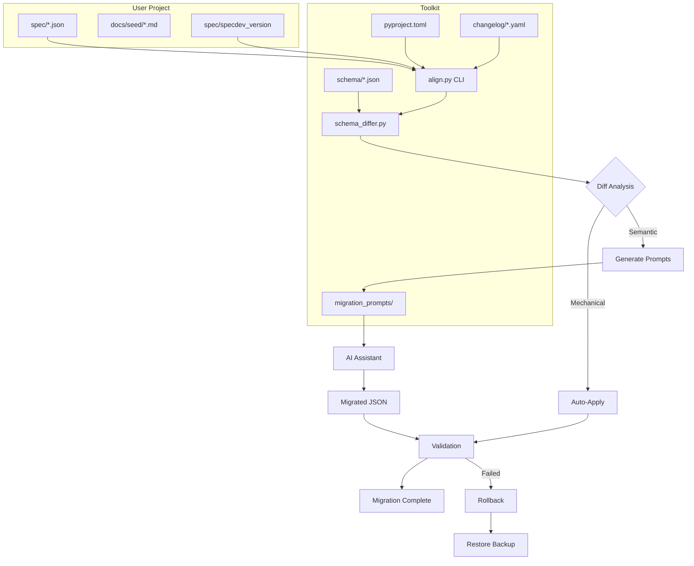

# DevSpec Toolkit Migration System Specification

> **Version**: 0.1.0-draft  
> **Status**: Design Specification  
> **Last Updated**: 2026-01-14

---

## Problem Statement

### Core Challenges

Migrating projects to newer DevSpec Toolkit versions is **difficult due to breaking changes** in schemas, step renumbering, and paradigm shifts. The current approach documented in `workflow_migration.md` is:

- **Manual and time-consuming**: Requires user to manually patch JSON validation errors
- **Prone to silent data loss**: Fields that don't map may be dropped without warning
- **Lacks systematic guidance**: No clear mapping from old structures to new
- **No rollback safety**: Easy to corrupt specs with no recovery path

### Pain Points

| Pain Point | Description |
|------------|-------------|
| **Chain Migration Complexity** | Migrating v1→v4 requires understanding v1→v2→v3→v4 changes (O(n²) scripts) |
| **Step Renumbering** | Step 13 becomes Step 15, Step 14-17 merge into Step 16a/b/c |
| **Schema Strictness Evolution** | `additionalProperties: false` added retroactively breaks existing files |
| **Paradigm Shifts** | Prose documents (roadmap.md) need conversion to structured JSON |
| **Missing Required Fields** | New required fields (e.g., `user_story` in milestones) have no source data |
| **Custom Extensions** | Project-specific specs (13b-m) have no toolkit schema |

### Scope

This migration system addresses:
- **Version Migration**: Adapting existing specs to new toolkit versions
- **Bootstrap Legacy**: Treated as "migrating from empty" (uses existing workflow)
- **Feature Extension**: Treated as "additive changes" (uses existing workflow)

---

## Core Philosophy

> **Canonical Target**: Migrate **TO** the current schema, not **FROM** old versions.

### Why Canonical Target?

Instead of maintaining `v1→v2→v3→v4` migration chains:
- Compare user specs against **current toolkit schemas**
- Identify all gaps (missing, extra, renamed, type mismatches)
- Generate a **tailored migration plan** for the user's specific situation
- Apply mechanical fixes automatically
- Generate AI prompts for semantic migrations

### Key Principles

| Principle | Description |
|-----------|-------------|
| **Lossless by Default** | No data silently discarded; unmappable data goes to `_migration_notes.md` |
| **AI-Assisted, Not AI-Dependent** | CLI generates prompts; users run externally with their preferred models |
| **Mechanical vs Semantic** | Auto-apply simple changes (renames); prompt for complex conversions |
| **Safe Rollback** | Hybrid backup: Git branch + folder copy |
| **Explicit Mapping** | Changelog declares exact field/step mappings, not heuristics |

---

## Design Decisions

### Finalized Decisions

| Decision | Choice | Rationale |
|----------|--------|-----------|
| **CLI Command Name** | `specdev align` | Semantic alignment with toolkit, not just version upgrade |
| **Versioning Format** | Semantic (`MAJOR.MINOR.PATCH`) | Industry standard; MAJOR = breaking changes |
| **AI Integration** | Generate prompts, user runs externally | No runtime AI dependency; user controls models |
| **Backup Strategy** | **Hybrid**: Git branch + folder copy | Git for easy rollback; folder copy for non-Git users and extra safety |
| **Prompt Templates** | Generic operation-based, verbose | Reusable across versions; verbose for predictability |
| **Step Identification** | Explicit mapping in changelog | Not heuristics; declared in machine-readable YAML |
| **Semantic Checks** | Self-Audit Gates in AI prompts | AI validates its own output before returning |
| **Changelog Format** | Per-version YAML files + human CHANGELOG.md | Machine-parseable + human-readable |

### Rejected Alternatives

| Alternative | Reason Rejected |
|-------------|-----------------|
| Chain migrations (v1→v2→v3) | Combinatorial explosion; every version needs N-1 scripts |
| Version-specific prompt templates | Maintenance burden; same operation across versions |
| Direct AI integration in CLI | Runtime dependency; model preference varies |
| Date-based versioning | Less informative about breaking vs non-breaking changes |
| Automatic semantic inference | Too risky; explicit mapping is safer |
| Git-only backup | Excludes users who check in spec without Git; extra safety needed |

---

## Architecture Overview



---

## Unified Workflows

The `specdev align` infrastructure serves as the **shared foundation** for all three DevSpec workflows:

```
┌─────────────────────────────────────────────────────────────────────────────┐
│                         specdev align Infrastructure                         │
├─────────────────────────────────────────────────────────────────────────────┤
│                                                                              │
│  ┌─────────────────────────────────────────────────────────────────────────┐│
│  │                         Shared Components                                ││
│  │  • Schema Differ Engine    • Changelog Parser    • Prompt Generator     ││
│  │  • Gap Detection           • Backup/Rollback     • Validation           ││
│  └─────────────────────────────────────────────────────────────────────────┘│
│                                    │                                         │
│           ┌────────────────────────┼────────────────────────┐               │
│           ▼                        ▼                        ▼               │
│  ┌─────────────────┐    ┌─────────────────────┐    ┌─────────────────┐     │
│  │ Bootstrap Legacy│    │ Feature Extension   │    │ Version Upgrade │     │
│  │ (Brownfield)    │    │ (Greenfield+)       │    │ (Migration)     │     │
│  └────────┬────────┘    └─────────┬───────────┘    └────────┬────────┘     │
│           │                       │                          │              │
│           ▼                       ▼                          ▼              │
│  ┌─────────────────────────────────────────────────────────────────────────┐│
│  │                       Core Spec Suite (00-16)                            ││
│  └─────────────────────────────────────────────────────────────────────────┘│
│                                                                              │
└─────────────────────────────────────────────────────────────────────────────┘
```

### Bootstrap Legacy (Brownfield Projects)

**Use Case**: Existing codebase with no specs, onboarding to DevSpec.

**How `align` Infrastructure Helps**:
- `specdev align status` → Shows "no version detected", identifies as bootstrap case
- `specdev align diff` → Compares empty spec/ against all required steps, lists all missing
- `specdev align prompts` → Generates prompts for each missing step in dependency order
- **Gap Detection** → Identifies which steps already have partial prose (roadmap.md, docs/*.md)
- **Paradigm Conversion** → Converts existing prose docs to structured JSON specs

**Workflow Integration**:
```bash
# User runs bootstrap
$ specdev align status
  → "No specdev_version found. Treating as bootstrap (empty → current)."

$ specdev align diff
  → Lists all 17 steps as MISSING
  → Detects roadmap.md, docs/overview.md as paradigm conversion candidates

$ specdev align prompts --mode bootstrap
  → Generates prompts for steps 00-16 in dependency order
  → Reuses template_prose_to_json.md for any existing markdown docs
```

### Feature Extension (Adding New Features)

**Use Case**: Specced project adding new capabilities.

**How `align` Infrastructure Helps**:
- `specdev align status` → Confirms project is aligned with current toolkit
- `specdev align diff` → Validates no drift before starting new feature
- **Gap Detection** → After feature work, detects if new steps needed (e.g., 13x extension)
- **Validation** → Confirms all traces resolve after adding new FRs/interfaces

**Workflow Integration**:
```bash
# Before adding feature
$ specdev align status
  → "Project aligned with toolkit v0.2.0. Ready for feature extension."

# After adding feature (user updates 04, 05, 08, 14)
$ specdev align validate
  → Confirms new content validates against schemas
  → Checks trace integrity (FR → Interface → Fixture links valid)
```

### Version Migration (Upgrading Toolkit)

**Use Case**: Updating toolkit submodule to newer version.

**How `align` Infrastructure Helps**:
- `specdev align status` → Detects version mismatch between project and toolkit
- `specdev align diff` → Computes exact delta (renames, missing fields, merged steps)
- `specdev align plan` → Generates step-by-step migration plan
- `specdev align apply --auto` → Applies mechanical fixes
- `specdev align prompts` → Generates AI prompts for semantic migrations
- `specdev align validate` → Confirms migration success
- `specdev align rollback` → Restores from hybrid backup if needed

**Workflow Integration**:
```bash
# After updating toolkit submodule
$ specdev align status
  → "Your project: v0.1.0 | Toolkit: v0.2.0 | Migration required."

$ specdev align plan
  → Shows mechanical fixes, AI-assisted steps, optional merges

$ specdev align apply --auto
  → Applies safe changes automatically

$ specdev align prompts
  → Generates context-rich prompts for remaining work
```

---

## Versioning Infrastructure

### Toolkit Version

Version is defined in `tools/pyproject.toml` and read at runtime via `get_toolkit_version()`:

**File**: `tools/pyproject.toml`
```toml
[project]
name = "specdev_tools"
version = "<current version>"
```

**Reading the version**:
```bash
# Shell — read directly from the source of truth:
grep 'version' devspec_toolkit/tools/pyproject.toml
# Or via the CLI:
specdev --version --repo-root ./devspec_toolkit
```

**Reading programmatically** (toolkit-internal code):
```python
from pathlib import Path
from specdev_tools.core.changelog_parser import get_toolkit_version

version = get_toolkit_version(Path("devspec_toolkit"))
# Returns the version string from tools/pyproject.toml, or None if unreadable.
# NOTE: always read from pyproject.toml directly — package metadata goes stale in editable installs.
```

### Project Version Tracking

**Decision**: Standalone file (Option A) for simplicity.

**File**: `spec/specdev_version` (not hidden)

```yaml
# spec/specdev_version
toolkit_version: "0.1.0"
created_at: "2026-01-14T00:00:00Z"
last_migration: null
migration_history: []
```

**After migration**:
```yaml
# spec/specdev_version
toolkit_version: "0.2.0"
created_at: "2026-01-14T00:00:00Z"
last_migration: "2026-02-01T00:00:00Z"
migration_history:
  - from: "0.1.0"
    to: "0.2.0"
    date: "2026-02-01T00:00:00Z"
    notes: "Added extension generator, roadmap JSON"
```

**Why not hidden file?**
- Version tracking is not an implementation detail
- Should be visible and editable by users
- Easier to inspect and debug

### CHANGELOG.md (Human-Readable)

Following [Keep a Changelog](https://keepachangelog.com/) format:

```markdown
# Changelog

All notable changes to this toolkit will be documented in this file.

## [Unreleased]

## [0.2.0] - 2026-02-01

### Added
- Step 13: Extension Generator (new step)
- Step 14: Roadmap with structured JSON schema
- `user_story` and `tasks` fields required in milestones

### Changed
- Step 13 → Step 15: Scaffold (renumbered)

### Paradigm Shift
- `roadmap.md` (prose) → `14_roadmap.json` (structured)
  - Use `template_prose_to_json.md` for conversion

### Merged
- Steps 14-17 (old) → Step 16: impl_context (unified Trinity loop)

## [0.1.0] - 2026-01-14

### Initial Release
- Baseline version for migration tracking
- Steps 00-16 core spec suite
```

### Changelog Structure

Each version has both human-readable and machine-readable changelogs:

| File | Purpose |
|------|---------|
| `changelog/format.yaml` | Schema defining valid change types and migration actions |
| `changelog/vX.Y.Z.md` | Human-readable version notes |
| `changelog/vX.Y.Z.yaml` | Machine-readable for automation |

### Machine-Readable Changelog (changelog/vX.Y.Z.yaml)

```yaml
# changelog/vX.Y.Z.yaml  (example — replace X.Y.Z with the actual version)
version: "X.Y.Z"
breaking: true

changes:
  # Step additions
  - type: add_step
    step_id: "13_extension_generator"
    description: "Discovers domain-specific extension needs"
    migration:
      action: generate
      prompt: template_add_step.md
      context_sources:
        - "spec/00_charter.json"
        - "spec/02_system_sketch.json"

  # Step renames
  - type: rename_step
    from: "13_scaffold"
    to: "15_scaffold"
    migration:
      action: auto
      operations:
        - rename_file
        - update_schema_ref

  # Field additions
  - type: add_field
    step_id: "14_roadmap"
    path: "milestones[].user_story"
    required: true
    description: "Each milestone must map to exactly one user story"
    migration:
      action: ai_assisted
      prompt: template_add_field.md

  # Paradigm shifts
  - type: paradigm_shift
    description: "Prose roadmap converted to structured JSON"
    detection:
      file_exists: "roadmap.md"
      file_missing: "spec/14_roadmap.json"
    migration:
      action: ai_assisted
      prompt: template_prose_to_json.md
      source: "roadmap.md"
      target: "spec/14_roadmap.json"
```

See [Changelog Entry Types](#changelog-entry-types) for full list of supported types.

---

## Backup Strategy (Hybrid)

### Why Hybrid?

| Scenario | Git Branch Alone | Folder Copy Alone | Hybrid ✓ |
|----------|------------------|-------------------|----------|
| Easy rollback via Git | ✓ | ✗ | ✓ |
| Works without Git | ✗ | ✓ | ✓ |
| Extra safety layer | ✗ | ✓ | ✓ |
| Preserved if Git history squashed | ✗ | ✓ | ✓ |
| Easy to inspect backup contents | ✗ | ✓ | ✓ |

### Implementation

Before any migration changes, create hybrid backup:

1. **Git branch** (if in Git repo): `backup/pre-migration-v{version}`
2. **Folder copy** (always): `spec/migration_backups/pre_v{version}_{timestamp}/`

```python
def create_backup(spec_dir: Path, target_version: str) -> BackupResult:
    """Create hybrid backup: Git branch + folder copy."""
    
    # 1. Git branch backup (if in Git repo)
    branch_name = f"backup/pre-migration-v{target_version}"
    if is_git_repo(spec_dir):
        git_checkout_branch(branch_name)
        git_commit("Pre-migration snapshot")
        git_checkout_previous()
    
    # 2. Folder copy backup (always)
    backup_dir = spec_dir / "migration_backups" / f"pre_v{target_version}_{timestamp}"
    backup_dir.mkdir(parents=True, exist_ok=True)
    
    # Copy all spec files (excluding migration_backups itself)
    for item in spec_dir.iterdir():
        if item.name != "migration_backups":
            if item.is_dir():
                shutil.copytree(item, backup_dir / item.name)
            else:
                shutil.copy2(item, backup_dir / item.name)
    
    return BackupResult(
        git_branch=branch_name if is_git_repo else None,
        backup_dir=backup_dir
    )
```

### Rollback Options

```bash
$ specdev align rollback

🔙 Rollback Options
━━━━━━━━━━━━━━━━━━━

Git Backups:
  1. backup/pre-migration-v0.2.0 (2 hours ago)

Folder Backups:
  2. spec/migration_backups/pre_v0.2.0_20260201_143022/ (2 hours ago)

Select backup [1]: 
```

### Backup Directory Structure

```
spec/
├── migration_backups/
│   ├── pre_v0.2.0_20260201_143022/
│   │   ├── specdev_version
│   │   ├── 00_charter.json
│   │   ├── 01_capabilities.json
│   │   └── ...
│   └── pre_v0.3.0_20260301_091500/
│       └── ...
├── specdev_version
├── 00_charter.json
└── ...
```

---

## CLI Commands

### Command Structure

```
specdev align <subcommand> [options]
```

### Subcommands Overview

| Command | Purpose |
|---------|---------|
| `align status` | Shows version mismatch between project and toolkit |
| `align diff` | Computes schema delta (what's missing, extra, renamed) |
| `align plan` | Generates tailored migration plan for specific gaps |
| `align apply --auto` | Applies mechanical fixes (renames, type coercion) |
| `align prompts` | Generates AI prompts for semantic migrations |
| `align validate` | Confirms migration success |
| `align rollback` | Restores from hybrid backup |

*(See full CLI output examples in Appendix A)*

---

## Prompt Templates

### Design Principles

Templates are designed for **predictability** and **consistency**:

1. **Verbose and Explicit**: No ambiguity; every instruction spelled out
2. **Structured Sections**: Consistent format across all templates
3. **Context Injection**: CLI substitutes placeholders with actual content
4. **Self-Audit Gates**: Mandatory verification checklist
5. **Lossless Focus**: Always preserve original data

### Template Catalog

| Template | Purpose | Trigger |
|----------|---------|---------|
| `template_add_step.md` | Generate missing step from context | New step in toolkit |
| `template_add_field.md` | Infer value for new required field | Field added to schema |
| `template_remove_field.md` | Handle removal of deprecated field | Field removed from schema |
| `template_rename_field.md` | Rename field preserving value | Field renamed in schema |
| `template_type_coercion.md` | Convert field to new type | Type changed in schema |
| `template_step_rename.md` | Rename file + update references | Step renumbered |
| `template_step_merge.md` | Combine multiple files into one | Steps consolidated |
| `template_step_split.md` | Split one file into multiple | Step decomposed |
| `template_prose_to_json.md` | Convert markdown to structured JSON | Paradigm shift |
| `template_json_to_prose.md` | Generate docs from JSON (rare) | Documentation sync |
| `template_archive_extension.md` | Move to archive without modification | Project extension |
| `template_resolve_conflict.md` | Handle unmappable data | Structural incompatibility |
| `template_infer_missing.md` | Infer missing required data from context | Missing required field |
| `template_validate_traces.md` | Fix broken trace references | Trace integrity failure |

### Template Structure (Standard Format)

All templates follow this structure for predictability:

```markdown
# Migration: [Operation Name]

## Purpose
[One paragraph explaining what this migration accomplishes and why]

## Context
[Injected at generation time]
- Source Version: {{SOURCE_VERSION}}
- Target Version: {{TARGET_VERSION}}
- Step ID: {{STEP_ID}}

## Source Data
{{SOURCE_CONTENT}}

## Target Schema
```json
{{TARGET_SCHEMA}}
```

## Field Requirements
{{#each REQUIRED_FIELDS}}
- `{{this.path}}`: {{this.description}}
  - Type: {{this.type}}
  - Constraints: {{this.constraints}}
{{/each}}

## Transformation Rules

### Rule 1: [Name]
[Explicit instruction with examples]

### Rule 2: [Name]
[Explicit instruction with examples]

...

## Handling Edge Cases

### If [condition]:
[What to do]

### If [condition]:
[What to do]

## Self-Audit Gate

Before returning your output, you MUST verify:

- [ ] All source data accounted for
- [ ] All required fields populated
- [ ] JSON validates against target schema
- [ ] No hallucinated data (only from source)
- [ ] `_migration_notes` captures any unmapped content
- [ ] Trace references are valid

## Output Contract

Write the final JSON artifact directly to disk at the step path under `spec/` (or runner-provided path).
Do NOT include explanatory text outside the code block.
The JSON must be valid and complete.
```

### Full Template Example: `template_prose_to_json.md`

```markdown
# Migration: Convert Prose Document to Structured JSON

## Purpose

Convert a prose/markdown specification document into a structured JSON format
that conforms to the DevSpec Toolkit schema. This operation is required when
the toolkit evolves from prose-based specs to machine-readable JSON specs.

The goal is **zero information loss**: every piece of information in the
source document must appear somewhere in the output JSON.

## Context

- Source Version: {{SOURCE_VERSION}}
- Target Version: {{TARGET_VERSION}}
- Operation: Paradigm Shift (Prose → JSON)
- Source File: `{{SOURCE_FILE}}`
- Target File: `{{TARGET_FILE}}`

## Source Document

The following is the complete content of the source prose document.
Read it carefully and ensure ALL information is preserved in the output.

```markdown
{{SOURCE_CONTENT}}
```

## Target Schema

The output must conform to this JSON Schema. Pay careful attention to
required fields, field types, and constraints.

```json
{{TARGET_SCHEMA}}
```

## Field Requirements

The following fields are REQUIRED in the output:

{{#each REQUIRED_FIELDS}}
### `{{this.path}}`
- **Type**: {{this.type}}
- **Description**: {{this.description}}
- **Constraints**: {{this.constraints}}
- **Extraction Hint**: {{this.extraction_hint}}

{{/each}}

## Transformation Rules

### Rule 1: Document Structure → Object Hierarchy

Map document structure to JSON objects:
- Document title → Root `id` and `name` fields
- Top-level sections (H1, H2) → Top-level object properties
- Nested sections → Nested objects or array items
- Bullet lists → Array items

**Example**:
```markdown
## Phase 1: Foundation
- Set up database
- Configure auth
```

Becomes:
```json
{
  "milestones": [{
    "name": "Foundation",
    "tasks": ["Set up database", "Configure auth"]
  }]
}
```

### Rule 2: Status Annotations → Enum Values

Convert status text to schema enum values:
- "Done", "Complete", "Finished", "✓" → `"done"`
- "In Progress", "WIP", "Started" → `"in_progress"`
- "TODO", "Pending", "Planned" → `"pending"`
- "Blocked", "On Hold" → `"blocked"`

**Example**:
```markdown
- [x] Set up database (Complete)
```

Becomes:
```json
{"task": "Set up database", "status": "done"}
```

### Rule 3: Dates and Times → ISO 8601

Convert any date references to ISO 8601 format:
- "January 14, 2026" → `"2026-01-14"`
- "Jan 14" (no year) → `"2026-01-14"` (use current year)
- "Q1 2026" → `"2026-03-31"` (end of quarter)

### Rule 4: References and Links → Trace Fields

Convert cross-references to `trace_ref` arrays:
- "See FR-001" → `"trace_refs": ["fr-001"]`
- "Depends on Auth module" → `"dependencies": ["auth-module"]`

### Rule 5: Preserve Rich Context

If the source contains detailed notes, explanations, or context that
doesn't map to a specific schema field:
- Keep brief notes in the nearest `notes` or `description` field
- Move lengthy context to `_migration_notes` object

## Handling Edge Cases

### If a section has no clear schema mapping:
Add to `_migration_notes` object with section heading as key:
```json
{
  "_migration_notes": {
    "unmapped_section_legacy_notes": "Original content here..."
  }
}
```

### If a required field has no source data:
1. First, attempt to infer from related context
2. If inference impossible, use placeholder: `"TBD-MIGRATION-REQUIRED"`
3. Document in `_migration_notes` why field couldn't be populated

### If source contains ambiguous or conflicting information:
1. Use the most recent information
2. Document the ambiguity in `_migration_notes`
3. Mark with `"_needs_review": true` at that object level

## Self-Audit Gate

Before returning your output, you MUST verify each item:

- [ ] **Completeness**: Every section of the source document is accounted for
      (either in schema fields or in `_migration_notes`)
- [ ] **Required Fields**: All required fields have values
- [ ] **Valid JSON**: Output parses as valid JSON
- [ ] **Schema Compliance**: JSON structure matches target schema
- [ ] **No Hallucination**: All values derive from source document only
- [ ] **Lossless**: Nothing from source is silently dropped
- [ ] **Notes Review**: `_migration_notes` explains any caveats

## Output Contract

Write the final JSON artifact directly to disk at the step path under `spec/` (or runner-provided path).

The JSON must:
1. Be valid, parseable JSON
2. Conform to the target schema
3. Contain NO content outside the code block
4. Include `_migration_notes` object if any data couldn't be mapped

```json
{
  // Your complete output here
}
```
```

---

## Schema Differ Engine

### Data Structures

```python
from dataclasses import dataclass
from enum import Enum
from typing import List, Optional

class DiffType(Enum):
    MISSING_REQUIRED = "missing_required"
    EXTRA_FIELD = "extra_field"
    TYPE_MISMATCH = "type_mismatch"
    RENAME_CANDIDATE = "rename_candidate"
    SCHEMA_REF_OUTDATED = "schema_ref"
    STEP_MISSING = "step_missing"
    STEP_UNKNOWN = "step_unknown"

class MigrationAction(Enum):
    AUTO = "auto"
    AI_ASSISTED = "ai_assisted"
    MERGE = "merge"
    ARCHIVE = "archive"

@dataclass
class FieldDiff:
    path: str
    diff_type: DiffType
    expected: Optional[str]
    actual: Optional[str]
    action: MigrationAction
    auto_fixable: bool
    suggestion: Optional[str]

@dataclass
class StepDiff:
    step_id: str
    status: str
    source_file: Optional[str]
    target_file: Optional[str]
    field_diffs: List[FieldDiff]
    action: MigrationAction

@dataclass
class MigrationDiff:
    source_version: Optional[str]
    target_version: str
    steps: List[StepDiff]
    paradigm_shifts: List[dict]
    summary: dict
```

### Changelog Entry Types

```yaml
# Supported change types in changelog/vX.Y.Z.yaml

change_types:
  - add_step        # New step added to toolkit
  - remove_step     # Step removed from toolkit
  - rename_step     # Step renumbered/renamed
  - merge_steps     # Multiple steps consolidated into one
  - split_step      # One step decomposed into multiple
  - add_field       # New field added to schema
  - remove_field    # Field removed from schema
  - rename_field    # Field renamed in schema
  - change_type     # Field type changed
  - add_constraint  # New validation constraint
  - paradigm_shift  # Format change (prose→JSON)
```

---

## Error Handling

### Pre-Migration Validation

| Check | Action if Failed |
|-------|------------------|
| Git repository exists | Warn, skip Git backup, continue with folder copy only |
| Working tree clean | Warn, prompt to continue anyway |
| spec/ directory exists | Abort: "No spec/ directory found" |
| Toolkit version in pyproject.toml | Abort: "Cannot determine toolkit version" |

### During Migration

| Error | Recovery |
|-------|----------|
| File rename conflict | Prompt user to resolve; skip if declined |
| JSON parse error | Report file and line; skip file, continue |
| Schema validation fail | Show errors; prompt to retry or manual fix |
| Missing context file | Warn; generate prompt with available context |

### Rollback Safety

- Hybrid backup created **before** any changes
- Each operation logged to `spec/migration_log`
- Rollback from Git branch or folder backup

---

## Documentation Updates

### New Files to Create

| File | Purpose | Content |
|------|---------|--------|
| `CHANGELOG.md` | Human-readable changelog | Keep a Changelog format |
| `changelog/format.yaml` | Changelog format schema | Change types, migration actions |
| `changelog/vX.Y.Z.yaml` | Machine-readable release entry | Per-version changelog entry |
| `changelog/vX.Y.Z.md` | Human-readable release notes | Detailed step breakdown |
| `docs/developers/workflows/workflow_align.md` | User-facing alignment workflow | Full usage guide |

### Workflows to Update

| Workflow File | Updates Required |
|---------------|------------------|
| `workflow_migration.md` | Reference `specdev align` CLI, deprecate manual approach, add "When to Use" section |
| `workflow_bootstrap_legacy.md` | Add section on using `align status` and `align diff` for gap detection |
| `workflow_feature_extension.md` | Add section on using `align validate` after feature work |

### Other Documentation Updates

| File | Changes |
|------|---------|
| `docs/developers/getting_started.md` | Add version tracking setup, `specdev align status` check |
| `docs/developers/index.md` | Add links to alignment workflow and tools |
| `README.md` | Add "Versioning & Migration" section |

### Tools Documentation to Create

| File | Purpose | Content |
|------|---------|--------|
| `docs/developers/tools/align.md` | CLI reference for align command | All subcommands, options, examples |
| `docs/developers/tools/schema_differ.md` | Schema differ library reference | API, data structures, usage |
| `docs/developers/tools/changelog_parser.md` | Changelog parser reference | YAML format, entry types |

### Detailed Content Requirements

#### `workflow_align.md` Contents
1. **Overview**: What is spec alignment and when needed
2. **Prerequisites**: Clean Git state, toolkit submodule updated
3. **Workflow Steps**:
   - Check status: `specdev align status`
   - Review diff: `specdev align diff`
   - Generate plan: `specdev align plan`
   - Apply mechanical fixes: `specdev align apply --auto`
   - Generate AI prompts: `specdev align prompts`
   - Run AI-assisted migrations (manual)
   - Validate: `specdev align validate`
4. **Rollback**: How to roll back if needed
5. **Troubleshooting**: Common issues and solutions
6. **FAQ**: Frequently asked questions

#### `workflow_migration.md` Updates
1. Add deprecation notice for manual approach
2. Reference `specdev align` as preferred method
3. Keep manual instructions as fallback
4. Add "Choosing Between Manual and CLI" section

#### `workflow_bootstrap_legacy.md` Updates
1. Add "Pre-Bootstrap Check" using `specdev align status`
2. Show how `align diff` identifies missing steps
3. Show how `align prompts --mode bootstrap` generates all prompts

#### `workflow_feature_extension.md` Updates
1. Add "Pre-Feature Check" using `specdev align status`
2. Add "Post-Feature Validation" using `specdev align validate`

#### Tools Reference (`docs/developers/tools/align.md`)
```markdown
# specdev align - Toolkit Alignment CLI

## Synopsis
specdev align <subcommand> [options]

## Subcommands

### status
Check alignment between project and toolkit versions.

### diff
Compute and display migration delta.

### plan
Generate step-by-step migration plan.

### apply
Apply migration changes.

Options:
  --auto    Apply only mechanical fixes
  --dry-run Show what would be changed without changing

### prompts
Generate AI prompts for semantic migrations.

Options:
  --output DIR    Output directory for prompts
  --mode MODE     bootstrap|upgrade (default: upgrade)

### validate
Validate migrated specs against schemas.

### rollback
Restore from backup.
```

---

## Directory Structure

```
devspec_toolkit/
├── CHANGELOG.md                     # Human-readable summary
├── changelog/                       # Per-version changelogs
│   ├── format.yaml                  # Schema for changelog YAML files
│   ├── vX.Y.Z.md                    # Human-readable release notes (one per version)
│   └── vX.Y.Z.yaml                  # Machine-readable release entry (one per version)
├── tools/
│   └── pyproject.toml               # version = "X.Y.Z"
├── migration_prompts/               # Template library
│   ├── template_add_step.md
│   ├── template_add_field.md
│   ├── template_remove_field.md
│   ├── template_rename_field.md
│   ├── template_type_coercion.md
│   ├── template_step_rename.md
│   ├── template_step_merge.md
│   ├── template_step_split.md
│   ├── template_prose_to_json.md
│   ├── template_json_to_prose.md
│   ├── template_archive_extension.md
│   ├── template_resolve_conflict.md
│   ├── template_infer_missing.md
│   └── template_validate_traces.md
├── schema/                          # (existing)
├── prompts/                         # (existing)
├── docs/
│   └── developers/
│       ├── workflows/
│       │   └── workflow_align.md    # NEW
│       └── tools/
│           ├── align.md             # NEW
│           ├── schema_differ.md     # NEW
│           └── changelog_parser.md  # NEW
└── tools/
    └── specdev_tools/
        ├── align.py
        ├── schema_differ.py
        ├── changelog_parser.py
        └── prompt_generator.py

user_project/
└── spec/
    ├── specdev_version              # NOT hidden
    ├── migration_log                # NOT hidden
    ├── migration_backups/           # Folder backups (NOT hidden)
    │   └── pre_v0.2.0_20260201/
    ├── archive/                     # Archived files
    └── *.json                       # Spec files
```

---

## Implementation Phases

| Phase | Deliverables | Dependencies | Effort |
|-------|--------------|--------------|--------|
| **1: Versioning** ✅ | CHANGELOG.md, changelog/format.yaml, changelog/vX.Y.Z.* | None | Done |
| **2: Changelog Parser** ✅ | changelog_parser.py, YAML schema | Phase 1 | Done |
| **3: Schema Differ** ✅ | schema_differ.py, diff structures | Phase 2 | Done |
| **4: CLI Framework** ✅ | align.py (status, diff, plan) | Phase 3 | Done |
| **5: Auto-Apply** ✅ | apply --auto, folder backup, rollback | Phase 4 | Done |
| **6: Prompt Generation** ✅ | prompt_generator.py, all templates | Phase 4 | Done |
| **7: Workflow Docs** | workflow_align.md, workflow updates | Phase 5-6 | 2 days |
| **8: Tools Docs** | align.md, schema_differ.md, parser.md | Phase 7 | 1 day |
| **9: Validation** | align validate, testing | Phase 8 | 2 days |

**Total Estimated Effort**: 17 days

---

## Success Criteria

### Functional Requirements

- [x] `specdev align status` correctly detects version mismatch
- [x] `specdev align diff` identifies all step and field differences
- [x] `specdev align apply --auto` handles renames, $schema updates
- [x] `specdev align prompts` generates context-aware, verbose prompts
- [ ] `specdev align validate` confirms migration success
- [x] `specdev align rollback` restores from either Git or folder backup
- [ ] Bootstrap workflow uses align infrastructure for gap detection
- [ ] Feature extension workflow uses align for validation

### Non-Functional Requirements

- [ ] Migration never silently drops data
- [ ] All unmappable content appears in `_migration_notes`
- [x] Hybrid backup created before any file modification
- [x] Works without network access (no external AI calls)
- [ ] Verbose prompts produce predictable AI outputs

---

## References

- [Existing Migration Workflow](../workflows/workflow_migration.md)
- [Bootstrap Legacy Workflow](../workflows/workflow_bootstrap_legacy.md)
- [Feature Extension Workflow](../workflows/workflow_feature_extension.md)
- [16_impl_context Schema](../../../schema/16_impl_context.schema.json)

---

## Appendix A: Full CLI Output Examples

### `specdev align status` Output

```bash
$ specdev align status

🔍 Toolkit Migration Status
━━━━━━━━━━━━━━━━━━━━━━━━━━━
Current toolkit version: 0.2.0
Your project version:    0.1.0 (from spec/specdev_version)

Version Delta:
  0.1.0 → 0.2.0: 1 MINOR update (breaking)

⚠️  Migration recommended
   - 2 new steps to generate
   - 1 step to rename
   - 4 steps mergeable to unified format

Run `specdev align diff` for detailed analysis.
```

### `specdev align diff` Output

```bash
$ specdev align diff

📊 Migration Diff Report
━━━━━━━━━━━━━━━━━━━━━━━━

Step Inventory (16 steps in current toolkit):
  ✅ 00_charter.json .................. OK
  ✅ 01_capabilities.json ............. OK
  ✅ 02_system_sketch.json ............ OK
  ✅ 03_glossary.json ................. OK
  ✅ 04_fr_list.json .................. OK
  ✅ 05_interface_contracts.json ...... OK
  ✅ 06_invariants.json ............... OK
  ✅ 07_nfrs.json ..................... OK
  ✅ 08_fixtures.json ................. OK
  ✅ 09_implementation_plan.json ...... OK
  ✅ 10_governance.json ............... OK
  ✅ 11_redteam.json .................. OK
  ✅ 12_ci_gates.json ................. OK
  ⚠️  13_scaffold.json ................ RENAME to 15_scaffold.json
  ❌ 13_extension_generator.json ...... MISSING (new in v0.2.0)
  ❌ 14_roadmap.json .................. MISSING (paradigm shift from roadmap.md)

Paradigm Shifts Detected:
  📝 roadmap.md exists but 14_roadmap.json missing
     → Requires AI-assisted conversion

Summary:
  ✅ 13 steps OK
  ⚠️  1 step needs rename
  ❌ 2 steps missing (need generation)
  📝 1 paradigm shift detected
```

### `specdev align apply --auto` Output

```bash
$ specdev align apply --auto

🔧 Applying Mechanical Fixes
━━━━━━━━━━━━━━━━━━━━━━━━━━━━

[1/4] Creating backup...
      Git branch: backup/pre-migration-v0.2.0
      Folder: spec/migration_backups/pre_v0.2.0_20260201_143022/
      ✅ Backup complete

[2/4] Renaming 13_scaffold.json → 15_scaffold.json...
      ✅ File renamed

[3/4] Updating $schema in 15_scaffold.json...
      ✅ Schema reference updated

[4/4] Updating spec/specdev_version...
      ✅ In-progress marker added

✅ Mechanical fixes complete (4/4)

Remaining work requires AI assistance.
Run `specdev align prompts` to generate migration prompts.
```

### `specdev align validate` Output

```bash
$ specdev align validate

🔍 Post-Migration Validation
━━━━━━━━━━━━━━━━━━━━━━━━━━━

Schema Validation:
  ✅ 00_charter.json
  ✅ 01_capabilities.json
  ✅ 02_system_sketch.json
  ... (10 more)
  ✅ 13_extension_generator.json
  ✅ 14_roadmap.json
  ✅ 15_scaffold.json
  ✅ 16_impl_context.json

Trace Integrity:
  ✅ All trace references resolve to valid targets

Migration Notes:
  ℹ️  _migration_notes.md exists (2 warnings to review)

Result: ✅ PASSED

Updating spec/specdev_version to 0.2.0...
✅ Migration complete
```
